# 
<sub>These materials are for informational purposes only and do not constitute legal advice. You should contact an attorney to obtain advice with respect to the development of a research app and any applicable laws.</sub>

# Obtaining Consent

Research studies that involve human subjects typically require some form of ethics review. Depending on the country, this may be review by an institutional review board (IRB) or by an ethics committee (EC). For some studies, informed consent may be required to conduct a research study, which means that the researcher must ensure that each participant is fully informed about the nature of the study, and must obtain a signed consent from each participant.  Additionally, consent may be required as a condition of app review.

The ResearchKit™ framework makes it easy to display your consent document and to obtain a participant's signature. Note that the ResearchKit framework does not include digital signature support. If the signature needs to be verifiable and irrevocable, you are responsible for producing a digital signature or for generating a PDF that can be used to attest to the identity of the participant and the time at which the form was signed.

To use the ResearchKit framework to obtain consent, start by creating a consent document model object (`ORKConsentDocument`) that represents the consent document. 

In the consent document model, encode each section of your consent document and the signatures that are needed. After you have the structure of your consent form in the document model, present a visual, animated sequence to help the user understand it by adding the document to a visual consent step (`ORKVisualConsentStep`).  To present the document for review and obtain a signature, add the document to a consent review step (`ORKConsentReviewStep`). To present the visual consent and consent review steps together, create a consent task that contains the steps and present them using an `ORKTaskViewController` object.

You can also add other steps into your consent sequence. For example, a consent sharing step (`ORKConsentSharingStep`) can be used to explicitly obtain permission to share the data your study is collecting with other researchers, if allowed by your IRB or EC. Or you can add instruction, form, or question steps to ask comprehension questions to verify that your prospective participants understand the nature of the study.

## 1. Create the Consent Document Model

To create a consent document model, first decide how you want to present your consent document. Categorize your content into sections based on what information you present to participants. After you have the structure for your consent document, you can replicate the same structure using the consent document model object (`ORKConsentDocument`).

The ResearchKit framework comes with some predefined sections that are commonly included in consent documents:

* Overview (`ORKConsentSectionTypeOverview`)
* Data gathering (`ORKConsentSectionTypeDataGathering`)
* Privacy (`ORKConsentSectionTypePrivacy`)
* Data use (`ORKConsentSectionTypeDataUse`)
* Time commitment (`ORKConsentSectionTypeTimeCommitment`)
* Surveys (`ORKConsentSectionTypeStudySurvey`)
* Tasks (`ORKConsentSectionTypeStudyTasks`)
* Withdrawal (`ORKConsentSectionTypeWithdrawing`)

The predefined sections include appropriate images and localized titles. To use a predefined section, use the `content` or `htmlContent` properties of `ORKConsentSection` object to supply a short, one-line summary of the section and the content to display if the participant taps the Learn More button.

If you use the predefined sections in the expected order, the ResearchKit framework animates the transitions between the sections, giving a more fluid participant experience.

After you create a section, you create a step to present the section. 

```swift
let document = ORKConsentDocument()

let section1 = ORKConsentSection(type: .dataGathering)
section1.title = "The title of the section goes here ..."
section1.summary = "The summary about the section goes here ..."
section1.content = "The content to show in learn more ..."

// Create additional section objects for later sections
document.sections = [section1, ...]

let step = ORKVisualConsentStep(identifier: "VisualConsentStep", document: document)
// And then create and present a task including this step.
```

If the predefined consent sections do not adequately cover the sections of your consent document, you can create your own custom sections. You can also create your own images and animations and add them to your consent section, to complete the experience. The animations you add should be H.264 videos; for best results, try to match the assets included with the ResearchKit framework.

### Create a Visual Consent Step

The visual consent step presents the sections of the consent document.
It is your responsibility to populate the visual consent step with
content; the `ORKVisualConsentStep` object doesn't contain any
default content.

```swift
// Add consent sections for each page of visual consent; for example:
let section1 = ORKConsentSection(type: .dataGathering)
document.sections = [section1, ...]

// Add the document to a visual consent step and/or a review step:
let step = ORKVisualConsentStep(identifier: "VisualConsentStep", document: document)

// Create and present a task including this step.
```

Visual step is presented as:

<kbd>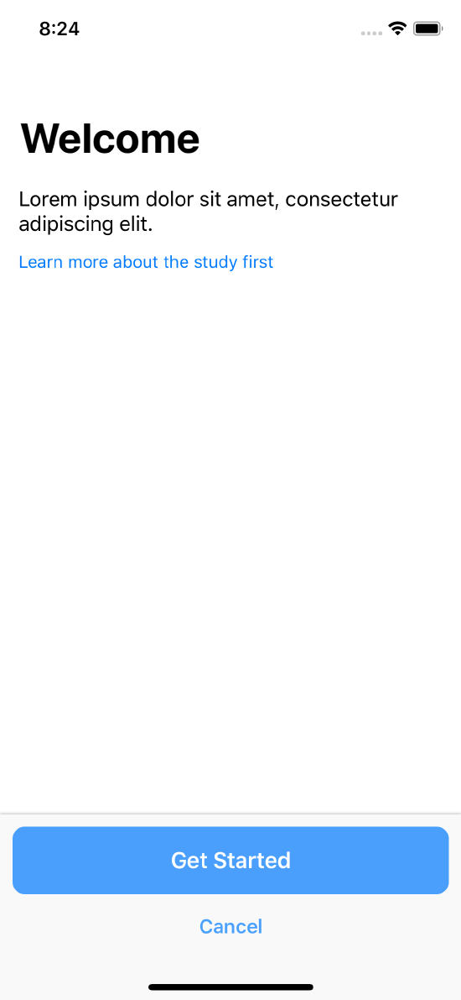</kbd>

> Consent overview screen (ORKConsentSectionTypeOverview object)

<kbd>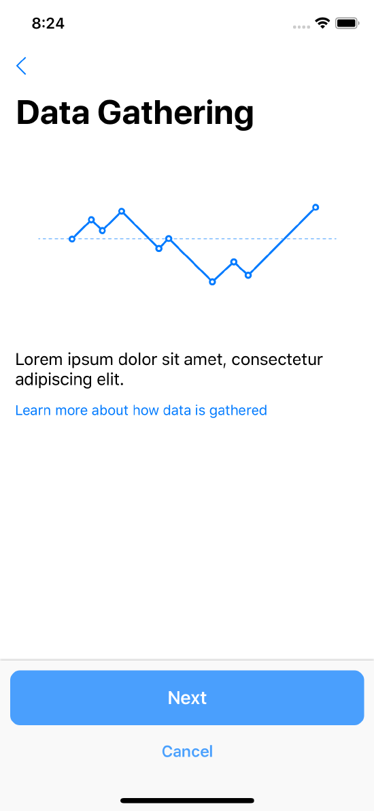</kbd>
    
> Data gathering (ORKConsentSectionTypeDataGathering object)

<kbd>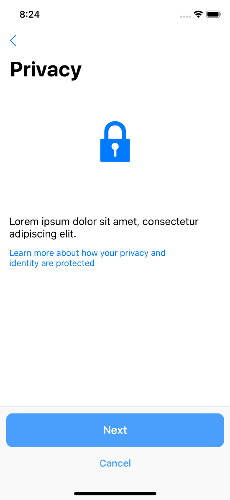<kbd>
    
> Privacy (ORKConsentSectionTypePrivacy object)

<kbd>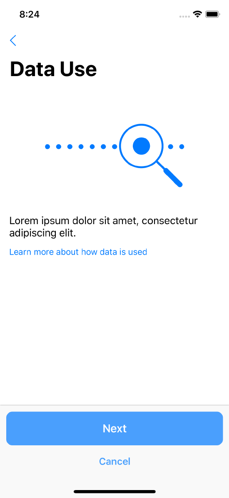</kdb>

> Data use disclosure (ORKConsentSectionTypeDataUse object)

<kbd>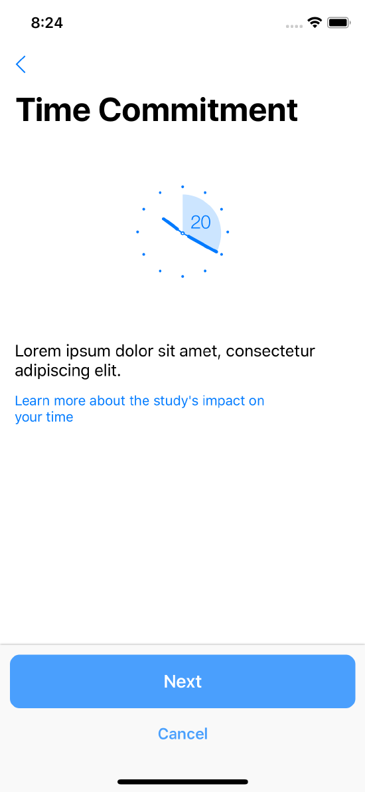
    
> Time commitment (ORKConsentSectionTypeTimeCommitment object)

<kbd>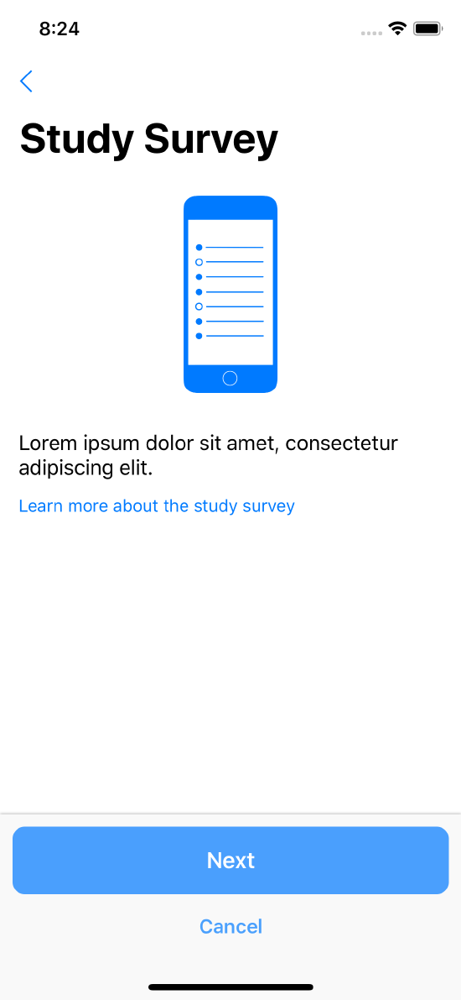</kbd>

> Type of study survey (ORKConsentSectionTypeStudySurvey object)</p>

<kbd>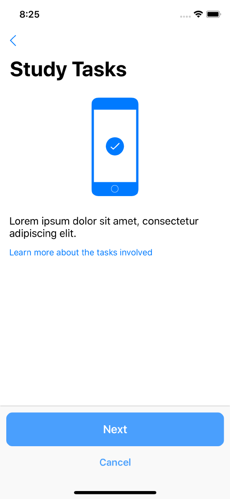</kbd>

> Study tasks (ORKConsentSectionTypeStudyTasks object)

<kbd>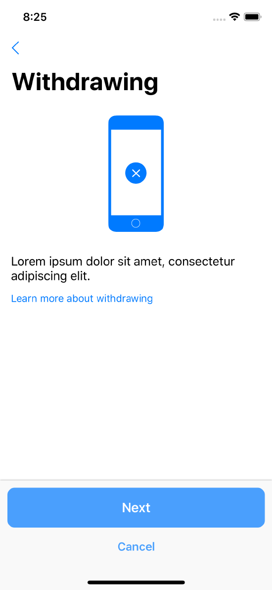</kbd> 
 
> Consent withdrawal (ORKConsentSectionTypeWithdrawing object)

<kbd>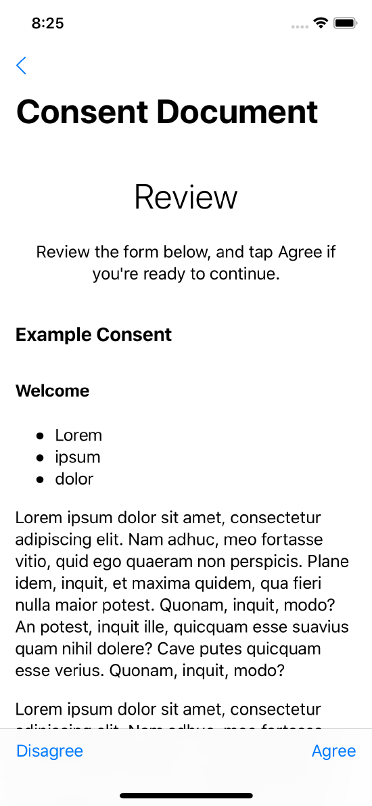</kbd>

> Custom consent section (ORKConsentSectionTypeCustom object)</p>

### Add a Review Step

Participants review the consent review document in the consent review step (`ORKConsentReviewStep`). Depending on your signature requirements, a participant can also be asked to enter their name and write a signature on the screen.

The content for consent review can either be produced as a concatenation of all the consent sections in your document model, or you can provide entirely separate review content as HTML in the consent document's `htmlReviewContent` property.

When the participant agrees to the content in the consent form, a confirmation dialog is shown. The text of this dialog is customizable using the `reasonForConsent` property of `ORKConsentReviewStep`.

The name entry page is included in a consent review step if the step’s `signature` property contains a signature object in which the `requiresName` property is YES. Similarly, the signature entry page is included in a consent review step if the step’s `signature` property contains a signature object in which the `requiresSignature` property is YES.

```swift
let consent = ORKConsentDocument()
consent.title = "Demo Consent"
consent.signaturePageTitle = "Consent"

let reviewStep = ORKConsentReviewStep(identifier: "ConsentReviewStep", signature: consent.signatures[0], in: consent)
reviewStep.text = "Lorem ipsum .."
reviewStep.reasonForConsent = "Lorem ipsum ..."

// Add the content to a task and present it.
```

Review step is presented as:

<kbd>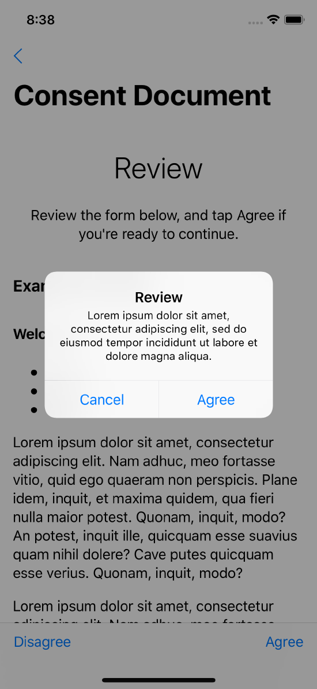</kbd>
    
> Consent review (ORKConsentReviewStep object)

<kbd>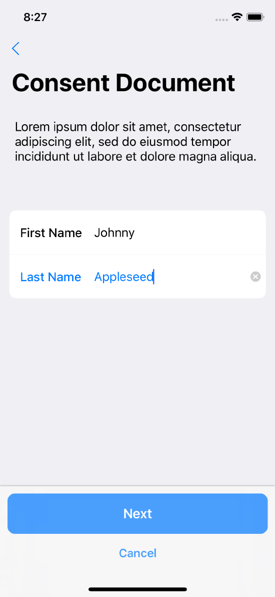</kbd>
 
> Agreeing to the consent document (reasonForConsent property of ORKConsentReviewStep object)

<kbd>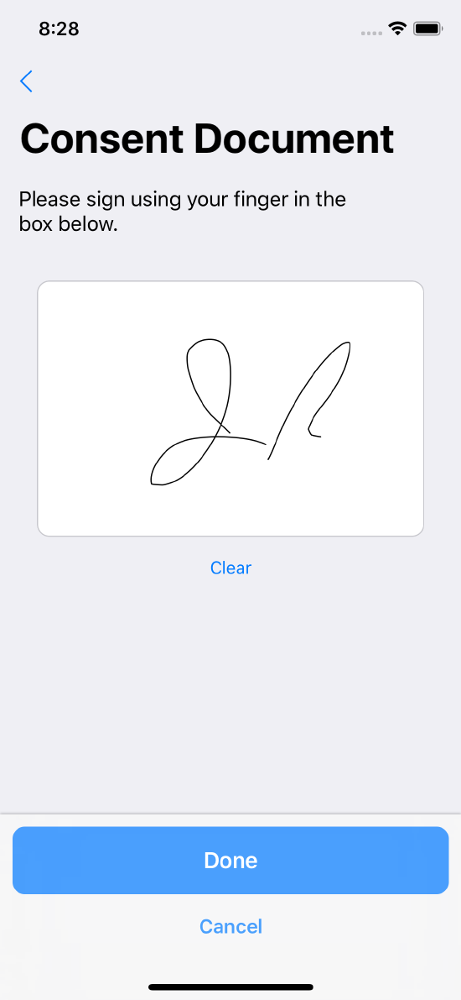</kbd> 

> Consent review name entry (signature property in ORKConsentReviewStep)

<kbd>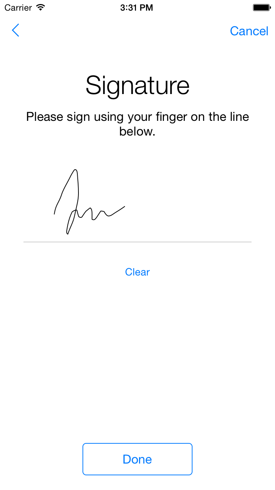</kbd>

> Consent review signature (signature property in ORKConsentReviewStep)

### Consent Sharing Step 

The primary aim of apps which use the ResearchKit framework is to collect data for a
specific study. But if you want to ask participants to share their data with other
researchers, participants must be able to control this.

A consent sharing step (`ORKConsentSharingStep`) can be used to explicitly obtain permission
to share their data that you collect for your study with other researchers, if allowed by
your IRB or EC if applicable. To use a consent sharing step, include it in a task, perhaps
just before a consent review step.

```swift
let sharingStep = ORKConsentSharingStep(identifier: "ConsentSharingStep", investigatorShortDescription: "MyInstitution", investigatorLongDescription: "MyInstitution and its partners", localizedLearnMoreHTMLContent: "Lorem ipsum...")

// Then include this step to a task and present with a task view controller.
```

The consent sharing step looks like this:

<kbd>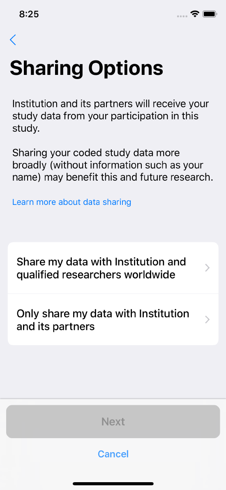</kbd>

> Example of a consent sharing step.

## 2. Create the Consent Task

After you create the step(s), create an `ORKOrderedTask` task and add them to it. To present the task, attach your task to a task view controller and present it.

The following code snippet shows how to create a task with a visual consent step and a consent review step:

```swift
let visualStep = ORKVisualConsentStep(identifier: "VisualConsentStep", document: document)
let reviewStep = ORKConsentReviewStep(identifier: "ConsentReviewStep", signature: consent.signatures[0], in: consent)
// Configure the steps.

// Create a task containing those steps.
let task = ORKOrderedTask(identifier: "ConsentTask", steps: [visualStep, reviewStep])

let taskViewController = ORKTaskViewController(task: task, taskRun: nil)

// And then present the task view controller.
```

## 3. Optionally, Generate a PDF

The ResearchKit framework can help you generate a PDF of the signed consent form and provide it to the participant. For example, your app could generate the PDF locally, write it to disk, email it to the participant, display it in the app, or send it to a server.

To do this, first take any signature results from the completed consent review, and apply the resulting signatures to a copy of your consent document. Then, call the `makePDFWithCompletionHandler:` method of `ORKConsentDocument` as shown here.

```swift
let documentCopy = document.copy() as! ORKConsentDocument

let signatureResult: ORKConsentSignatureResult = taskViewController.result.stepResult(forStepIdentifier: "ConsentReviewStep")?.firstResult as! ORKConsentSignatureResult

documentCopy.makePDF{ (data, error) -> Void in
    // Write the PDF data to disk, email it, display it, or send it to a server.
}
```

You can only apply a signature result to a new copy of a consent document. 
